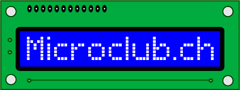
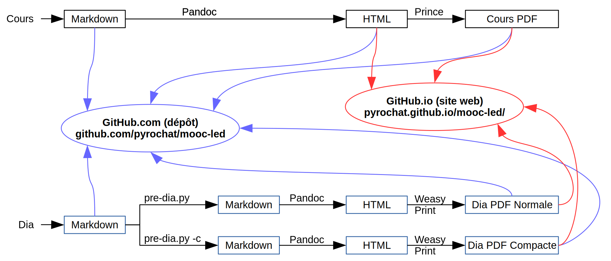
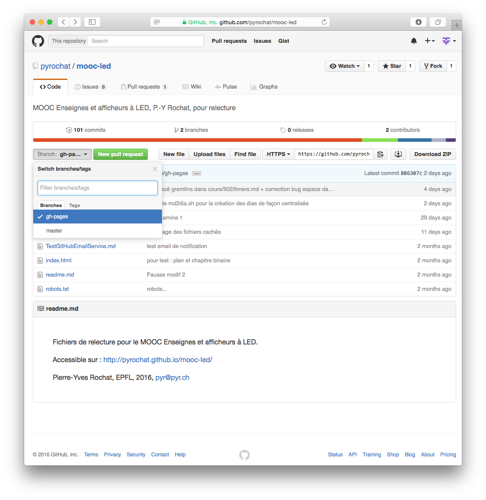
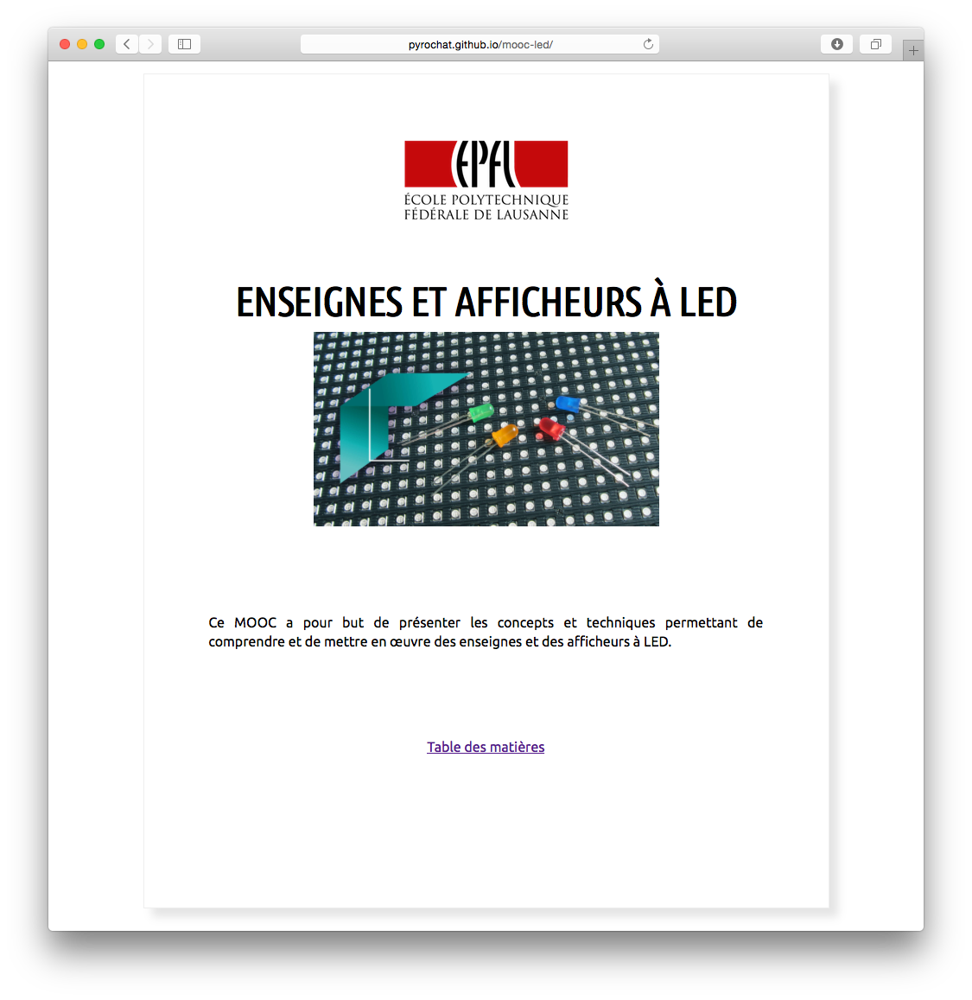
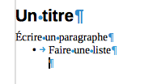
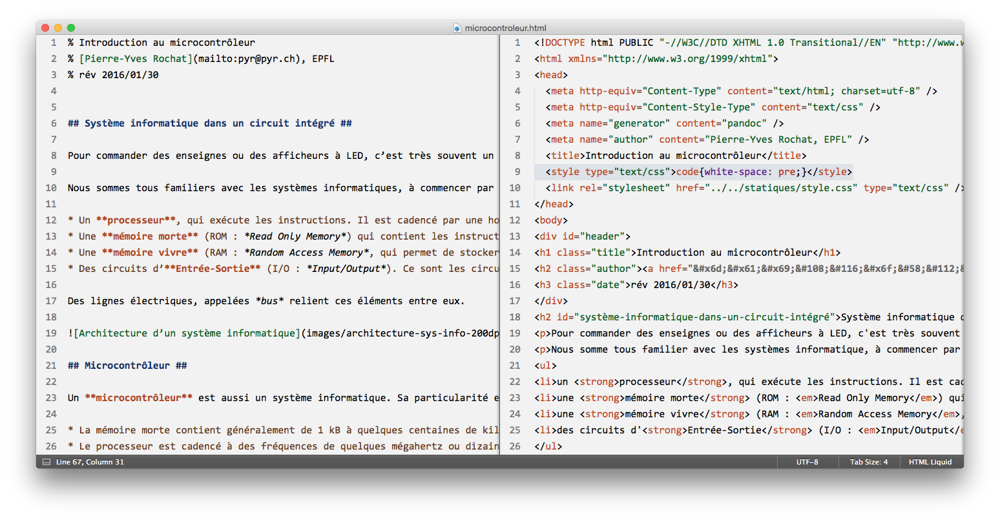
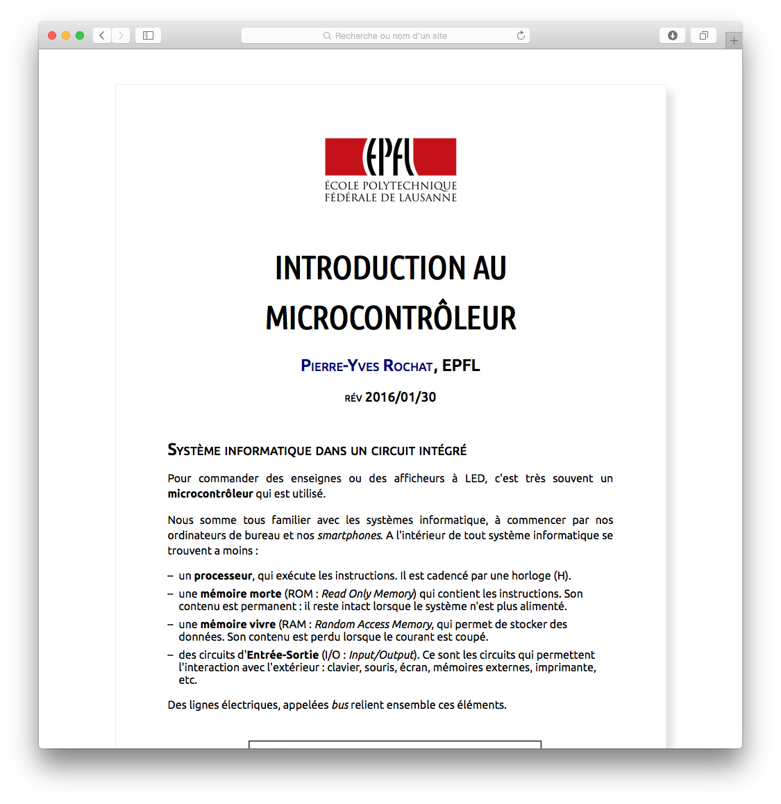
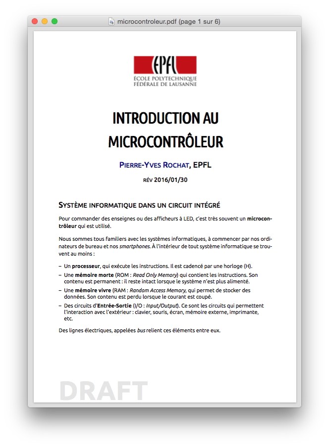

<!-- DIAPORAMA -->

<!-- Page de titre -->
<section class="page_de_garde">

Conférence Microclub

Outils collaboratifs pour la rédaction et l’édition

Nicolas Jeanmonod

11 mars 2016, Microclub, EPFL

</section>

<!-- Page bienvenue plein écran-->
<section>
# Fil rouge Présentation des points abordés{ class="en_tete" }
<!-- def A -->
<!-- def A -->
<!-- def A -->

<!-- def A -->**Outils collaboratifs pour la rédaction et l’édition**
<!-- def A -->

<!-- A -->

## Chaîne éditoriale
<!-- 2345678 -->- Édition des textes en Markdown pour les cours
<!--  345678 -->- Édition des textes en Markdown + HTML pour les dias
<!--   45678 -->- Génération des PDF pour les cours et les dias
<!--    5678 -->- Mise en ligne sur GitHub
<!--     678 -->- Corrections
<!--      78 -->- Pull request
<!--       8 -->- Intégration des corrections

</section>

<section>
<!-- A -->
# Fil rouge Présentation des points abordés{ class="en_tete" }

<!-- 234 -->## Contexte
<!-- 234 -->- MOOC LED de Pierre-Yves Rochat (<http://pyrochat.github.io/mooc-led/>)
<!--  34 -->- Besoin d’outils permettant la collaboration
<!--  34 -->    - L’intégrateur doit rester maitre du projet ⇒ Forking Workflow
<!--  34 -->    - L’historique doit être disponible
<!--  34 -->    - Les révisions doivent pouvoir être comparées
<!--   4 -->- Langages de balises
<!--   4 -->    - Permettent de contrôler directement le format
<!--   4 -->    - En format texte ⇒ peuvent être comparés facilement
<!--   4 -->    - HTML
<!--   4 -->    - Markdown

</section>

<section>
<!-- A -->
# Flux de production{ class="en_tete" }

</section>

<section>
<!-- A -->
# GitHub.com et GitHub.io{ class="en_tete" }

{ height=30cm }

{ height=30cm }

</section>

<section>
<!-- A -->
# Langages de balisage{ class="en_tete" }

Un langage de balisage enrichit l’information textuelle brute d’une information sémantique.

<b>Comparaison processus <b>WYSIWY</b>**M** vs <b>WYSIWY</b>**G**</b>

**Markdown**  

	# Un titre

	Écrire un paragraphe

	- Faire une liste

**HTML**  

	<h1>Un titre</h1>

	
Écrire un paragraphe

	<ul>
		<li>Faire une liste</li>
	</ul>

**Traitement de texte**  
{ width=10cm }

</section>

<section>
<!-- A -->
# Avantages des langages de balisage{ class="en_tete" }

- Séparation sémantique/visuel
- Basés sur des fichiers textes
	- éditables avec des éditeurs simples
	- faciles à comparer
	- faciles à gérer avec des logiciels SCM (Git,...)
	- résilients à l’obsolescence informatique
- Facile d’écrire des scripts pour automatiser les tâches récurrentes
- Nombreuses solutions logicielles
- Nombreux formats de sortie à partir d’une source unique
- Normes libres (non-propriétaires)

</section>

<section>
<!-- A -->
# Langages de balisage{ class="en_tete" }

<!-- 2345 -->- SGML (ancêtre du HTML)
<!--  345 -->- HTML
<!--   45 -->- XML (⇒ nombreuses grammaires, ex: **XHTML**, DocBook, SVG, ...)
<!--    5 -->- TeX/LaTeX

</section>

<section>
<!-- A -->
# Langages de balisage légers{ class="en_tete" }

<!-- 234567 -->- **Markdown**
<!--  34567 -->- **Pandoc Flavored Markdown (PFM)   = Pandoc’s extended Markdown**
<!--   4567 -->- GitHub Flavored **Markdown** (GFM)
<!--    567 -->- Multi**Markdown**
<!--     67 -->- **Markdown** Extra

<!--      7 -->- Textile
<!--      7 -->- Asciidoc
<!--      7 -->- reStructuredText
<!--      7 -->- kramdown
<!--      7 -->- Fountain

</section>

<section>
<!-- A -->
# Désavantages des langages de balisage{ class="en_tete" }

<!-- 23456789 -->- Difficiles d’accès aux non-techniciens
<!--  3456789 -->- Trop complexes pour être édités directement (HTML)
<!--   456789 -->- Beaucoup de choix tue le choix
<!--    56789 -->- Trop nombreuses versions d’un même vocabulaire
<!--    56789 -->	- Markdown ⇒ PFM, GFM,...
<!--    56789 -->	- HTML ⇒ DOCTYPE : HTML 5, HTML 4.01 Strict, HTML 4.01 Transitional...
<!--     6789 -->- Incompatibilité des agents utilisateurs (IE6...)

<!--      789 -->- Nombreux jeu de caractères codés (utf-8, Windows-1256,...). Moins problématique aujourd’hui puisque l’UTF-8 s’est imposé ([86% des sites internet l’utilise][3])
<!--       89 -->- Nécessitent souvent l’apprentissage de plusieurs vocabulaires (Markdown + HTML + CSS)
<!--        9 -->- Seul LaTeX est excellent pour le rendu des équations mathématiques, bien qu’il existe des solutions (MathJax par ex.) pour les autres langages.

</section>

<section>
<!-- A -->
# Normes Markdown{ class="en_tete" }

- Norme de base *by John Gruber*
	- <http://daringfireball.net/projects/markdown/>
- GitHub Flavored Markdown (GFM)
	- <https://help.github.com/categories/writing-on-github/>
- Pandoc (PFM)
	- <http://pandoc.org/README.html#pandocs-markdown>
	- **EPFL-ENAC-IT — Jean-Daniel Bonjour ⇒ Excellente ressource !** <http://enacit1.epfl.ch/markdown-pandoc/>
- CommonMark ⇒ projet de standardisation
	- <http://commonmark.org/>

</section>

<section>
<!-- A -->
# Bases du Markdown{ class="en_tete" }

	Le Markdown est conçu pour être :
		- facile à lire et à écrire
		- être transformé en HTML

	En Markdown traditionnel↵
	un paragraphe se termine avec deux retours↵
	à la ligne.↵
	↵
	Donc les 3 lignes ci-dessus ne forment qu’un seul
	paragraphe.

</section>

<section>
<!-- A -->
# Bases du Markdown{ class="en_tete" }

	# Titre de niveau 1 #####################

	Autre syntaxe pour niveau 1
	===========================

	## Titre de niveau 2

	Syntaxe _alternative_ pour niveau 2
	-----------------------------------

	### Titre de niveau 3 incluant [un lien](http://example.com/)

	#### Titre de niveau 4

</section>

<section>
<!-- A -->
# Bases du Markdown{ class="en_tete" }

	Paragraphe normal

	> Début du bloc de citation
	>
	> * élément de liste
	> * second élément
	>
	>> Décalage de 2ème niveau, usage de _styles_
	Markdown, <u>balises</u> HTML
	>
	> Bloc de code dans la citation

	Retour à l'alignement normal

</section>

<section>
<!-- A -->
# Bases du Markdown{ class="en_tete" }

## Faire un retour à la ligne ` `

- En Markdown classique, ce n’est pas possible (ce qui est quand même incroyable !)
- En MultiMarkdown et en GFM, il faut ajouter deux espaces à la fin de la ligne précédant le saut.
- Avec Pandoc, il faut ajouter une espace et un caractère `\` à la fin de la ligne précédant le saut.

</section>

<section>
<!-- A -->
# Pandoc Flavored Markdown (PFM){ class="en_tete" }

Le PFM est aussi appelé *“Pandoc’s extended Markdown”*

- Supporte les retours à ligne ` ` en ajoutant un “` \`” en fin de ligne
- Peut ajouter des attribut HTML : `# Exemple{ attribut="10cm" }`

## Pour les détails 

- <http://pandoc.org/README.html#pandocs-markdown>
- EPFL-ENAC-IT — Jean-Daniel Bonjour <http://enacit1.epfl.ch/markdown-pandoc/>

</section>

<section>
<!-- A -->
# Exemple de conversion avec Pandoc{ class="en_tete" }

    pandoc                              \
        --standalone                    \ # doc HTML entier
        --from markdown                 \ # format source
        --to html                       \ # format cible
        --highlight-style pygments      \ # rendu de code
        --email-obfuscation references  \ # anti-spam
        --normalize                     \ # enlève doubles espaces
        --css=$CSS_FILE                 \ # fichier CSS
        --output output.html            \ # fichier de sortie
        input.md                          # fichier en entrée

</section>

<section>
<!-- A -->
# Exemple de conversion avec Pandoc{ class="en_tete" }

{ height=30cm }

</section>

<section>
<!-- A -->
# Exemple de conversion avec Pandoc{ class="en_tete" }

{ height=30cm }

</section>

<section>
<!-- A -->
# Ressources HTML{ class="en_tete" }

- W3School
	- <http://www.w3schools.com/html/>
- Mozilla
	- <https://developer.mozilla.org/fr/docs/Web/HTML>
- W3C
	- Doctype XHTML1 : <https://www.w3.org/TR/xhtml1/>
	- Doctype HTML5 : <https://www.w3.org/TR/html5/>
	- Validation : <https://validator.w3.org/>

</section>

<section>
<!-- A -->
# Exemple de CSS{ class="en_tete" }

{ height=30cm }

</section>

<section>
<!-- A -->
# Conversion HTML – PDF avec Prince [princexml.com](http://www.princexml.com/) { class="en_tete" }

## Avantages

- [Résultats magnifiques][6]
- Supporte de nombreuses possibilités des CSS
- Peut exécuter des JavaScript lors de la génération
- Très rapide

## Désavantages

- Coûteux (495$)
- Pas utilisable tel quel par les non-techniciens car uniquement en ligne de commande

## Utilisation

	prince            \
		input.html    \
		-o output.pdf

</section>

<section>
<!-- A -->
# Conversion HTML – PDF avec WeasyPrint [weasyprint.org](http://weasyprint.org) { class="en_tete" }

## Avantages

- Gratuit (licence BSD)

## Désavantages

- Résultats parfois imprévisibles
- Ne supporte pas autant de possibilités CSS que Prince
- Pas de JavaScript lors de la génération
- Très lent
- Pas utilisable tel quel par les non-techniciens car uniquement en ligne de commande
- Potentiellement infernal à installer

## Utilisation

	weasyprint     \
		input.html \
		output.pdf

</section>

<section>
<!-- A -->
# Exemple de conversion avec Prince{ class="en_tete" }

{ height=30cm }

</section>

<section>
<!-- A -->
# Git{ class="en_tete" }

- SCM (Source Code Management) ⇒ Indispensable pour tout projet informatique
	- Permet de gérer l’historique
	- Permet de gérer la collaboration avec les participants
- Exemples
	- Git
	- Perforce
	- Mercurial
	- Bazaar
	- CVS
	- Subversion
	- [Liste de logiciels de SCM][2]

</section>

<section>
<!-- A -->
# Git – avantages et inconvénients{ class="en_tete" }

## Avantages

<!-- 234567 -->- Communauté très large ⇒ donc expérience réutilisable dans d’autres contextes + facilité de trouver des réponses
<!--  34567 -->- Open Source
<!--   4567 -->- Très rapide
<!--    567 -->- Facile à installer
<!--     67 -->- Disponible pour tous les OS courants
<!--      7 -->- Disponibilité de services d’hébergement gratuits comme GitHub, Bitbucket ou git.epfl.ch

</section>

<section>
<!-- A -->
# Git – avantages et inconvénients{ class="en_tete" }

## Inconvénients

<!-- 2345 -->- L’interface utilisateur est inutilement complexe. Aucune commande ne peut être déduite par la logique. Les noms des commandes sont troublants (par ex. `git blame` pour voir qui a fait quoi sur un fichier.)
<!--  345 -->- La gestion des fichiers volumineux est une option (GLFS Git Large File Storage)
<!--   45 -->- Pas de diff de fichiers binaires
<!--    5 -->- Il n’existe que des GUI qui n’aiderons pas les gens allergiques à la ligne de commande ⇒ difficile à utiliser par des non-techniciens

</section>

<section>
<!-- A -->
# GitHub – avantages et inconvénients{ class="en_tete" }

## Avantages des dépôts et des sites web

<!-- 2345678 -->- Gratuit
<!--  345678 -->- Pas de limite sur le nombre de dépôts
<!--   45678 -->- Possibilité de site web (autant qu’on veut à priori)
<!--    5678 -->- Bande passante OK
<!--     678 -->- Diff visuelles
<!--      78 -->- Projet public = publicité gratuite
<!--       8 -->- Facilité de clonage

</section>

<section>
<!-- A -->
# GitHub – avantages et inconvénients{ class="en_tete" }

## Inconvénients des dépôts

<!--  2345678 -->- Fichiers sensibles qui doivent rester dans l’entreprise ou sur le territoire
<!--   345678 -->- Limite de 1 GB
<!--    45678 -->- Sinon même limitations que Git

<!--     5678 -->## Inconvénients des sites web
<!--      678 -->- Uniquement statiques (pas de scripts côté serveur)
<!--       78 -->- Pas de possibilité d’utiliser des branches différentes (gh-pages ou master uniquement)
<!--        8 -->- Gestion du [CNAME][5] difficile quand on “forke”

</section>

<section>
<!-- A -->
# GitHub.com et GitHub.io{ class="en_tete" }

{ height=30cm }

{ height=30cm }

</section>

<section>
<!-- A -->
# GitHub – flux de travail{ class="en_tete" }

# [Forking Workflow][1]

- Le responsable de projet
	- crée un dépot sur GitHub
	- le clone sur un ordi
	- crée la branche “gh-pages”
	- défini cette branche comme défaut
	- “add+commit+push” les fichiers
	- accepte ou refuse les “pull request”

- Les collaborateurs
	- clonent le dépôt du responsable (optionnel)
	- “fork” le dépôt et clonent le “fork” sur un ordi
	- modifient ou ajoutent des fichiers
	- “add+commit+push” les fichiers vers leur “fork”
	- envoient des “pull request” au reponsable pour qu’il intègre les modifications
	- synchronisent leurs “fork”

</section>

<section style="display: none">

[1]: https://www.atlassian.com/git/tutorials/comparing-workflows/forking-workflow
[2]: https://en.wikipedia.org/wiki/List_of_version_control_software
[3]: https://fr.wikipedia.org/wiki/UTF-8
[4]: http://pandoc.org/README.html#templates
[5]: https://github.com/NicHub/ouilogique.com/blob/gh-pages/CNAME
[6]: http://www.princexml.com/howcome/2009/aquarist/AdvancedAquarist-2009-01.pdf

</section>

<section>
<!-- A -->
# Canvas{ class="en_tete" }

</section>
