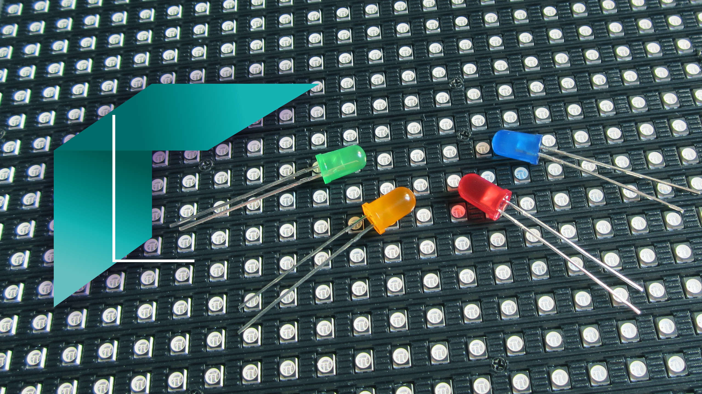
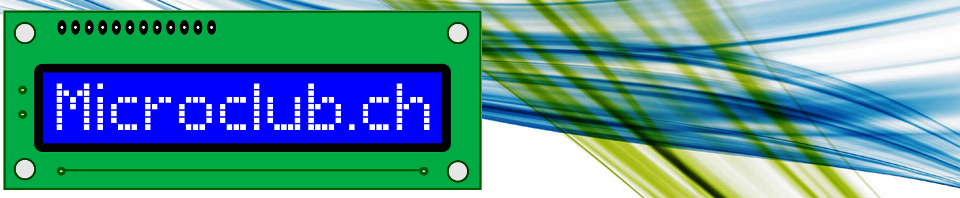

{ width=15% }

**CONFÉRENCE**
===

**« OUTILS COLLABORATIFS POUR LA RÉDACTION ET L’ÉDITION »**
===

{ width=30% }

## Date

Le vendredi 11 mars 2016 à 19 h

## Lieu

Microclub EPFL, av. Piccard, [salle de Conférences du DIT (Service informatique central)][1], en bus TL, [arrêt EPFL Piccard][2].

## Conférencier

[Nicolas Jeanmonod][3]

## Synopsis

Nicolas Jeanmonod présentera les techniques d’édition qu’il a mises en œuvre pour aider Pierre-Yves Rochat à la rédaction de [son MOOC sur les enseignes et afficheurs à LED][4].

Cette conférence peut intéresser toute personne amenée à rédiger des documents conséquents et intéressée à utiliser des langages de balisage comme le *HTML* et le *Markdown*. C’est aussi un bon exemple de l’utilisation de *Git* et *GitHub* dans un projet collaboratif.

## Sujets abordés

- Collaboration ⇒ *Git* et *GitHub*
- Hébergement du site web ⇒ *GitHub*
- Rédaction ⇒ *Markdown*
- Génération des HTML ⇒ *Pandoc* + *CSS*
- Génération des PDF ⇒ *WeasyPrint* + *Prince*
- Automatisation ⇒ *Python* + *Bash*
<!--

{ width=50% }
 -->

[1]: http://plan.epfl.ch/?zoom=20&recenter_y=5864094.08669&recenter_x=731129.54485&layerNodes=fonds,batiments,labels,information,parkings_publics,arrets_metro,transports_publics&q=DIT

[2]: http://information.epfl.ch/acces

[3]: mailto:nicolas.jeanmonod@gmail.com

[4]: http://pyrochat.github.io/mooc-led/
