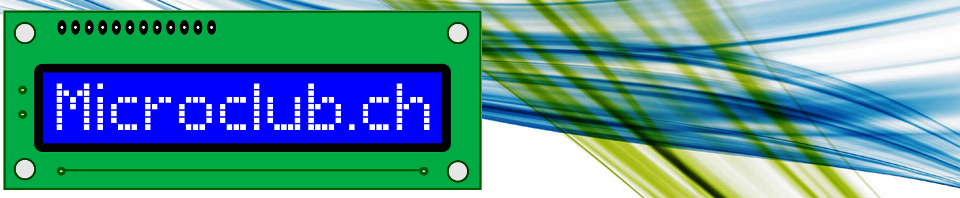

**OUTILS COLLABORATIFS POUR LA RÉDACTION ET L’ÉDITION**
========================================

**Plan de la conférence**
========================================

---

# Fil rouge : Présentation des points abordés

## Chaîne éditoriale

- Édition des textes en Markdown pour les cours
- Édition des textes en Markdown + HTML pour les dias
- Génération des PDF pour les cours et les dias
- Mise en ligne sur GitHub
- Corrections
- Pull request
- Intégration des corrections

## Contexte

- MOOC LED de Pierre-Yves Rochat
- Besoin d’outils permettant la collaboration
	- L’intégrateur doit rester maitre du projet ⇒ [Forking Workflow][1]
	- L’historique doit être disponible
	- Les révisions doivent pouvoir être comparées
- Langages de balises
	- Permettent de contrôler directement le format
	- En format texte ⇒ Peuvent être comparés facilement
	- HTML
	- Markdown

<!--
## Pour mémoire, ce que j’ai transmis au Microclub

- Collaboration ⇒ Git et GitHub
- Hébergement du site web ⇒ GitHub
- Rédaction ⇒ Markdown
- Génération des HTML ⇒ Pandoc + CSS
- Génération des PDF ⇒ WeasyPrint + Prince
- Automatisation des générations ⇒ Python + Bash
-->

---

**Collaboration ⇒ Git et GitHub**
==================================

## Git

- SCM (Source Code Management) ⇒ Indispensable pour tout projet informatique
	- Permet de gérer l’historique
	- Permet de gérer la collaboration avec les participants
- Exemples
	- Git
	- Perforce
	- Mercurial
	- Bazaar
	- CVS
	- Subversion
	- [Liste de logiciels de SCM][2]
- Pourquoi Git est bon ?
	- Communauté très large ⇒ donc expérience réutilisable dans d’autres contextes + facilité de trouver des réponses
	- Open Source
	- Très rapide
	- Facile à installer
	- Disponible pour tous les OS courants
	- Disponibilité de services d’hébergement gratuits comme GitHub, Bitbucket ou git.epfl.ch
- Pourquoi Git est franchement pas bon ?
	- L’interface utilisateur est inutilement complexe. Aucune commande ne peut être déduite par la logique. Les noms des commandes sont troublants (par ex. `git blame` pour voir qui a fait quoi sur un fichier.)
	- La gestion des fichiers volumineux est une option (GLFS Git Large File Storage)
	- Fichiers binaires
	- Il n’existe que des GUI qui n’aiderons pas les gens allergiques à la ligne de commande. ⇒ difficile à utiliser par des non-techniciens

## GitHub

- Pourquoi choisir GitHub ?
	- Gratuit
	- Pas de limite sur le nombre de dépôts
	- Possibilité de site web
	- Diff visuelles
	- Projet public = publicité gratuite
	- Facilité de clonage

- Quand ne pas choisir GitHub ?
	- Fichiers sensibles qui doivent rester dans l’entreprise ou sur le territoire
	- Sinon même limitations que Git

- Avantages des sites web hébergés sur GitHub
	- gratuits
	- bande passante OK

- Limitations des sites web hébergés sur GitHub
	- uniquement statiques (pas de scripts côté serveur)
	- pas de possibilité d’utiliser des branches différentes
	- gestion du CNAME difficile quand on “forke”

## Exemples de commandes Git

- Création d’un dépôt local
- Création de la branche “gh-pages”
...

## Création d’un dépôt sur GitHub

...

## Création d’une Pull Request

...

## Création d’un site web sur GitHub

- Branche “gh-pages”
- CNAME
	- Problème de confusion de noms de domaine lors de *Fork*

...

## Organisation des répertoires et des fichiers

...

---

**Langages de balisage**
========================

Un langage de balisage enrichit l’information textuelle brute d’une information sémantique.

## Comparaison processus WYSIWY**M** vs WYSIWY**G**

| WORD             | HTML                                  | Markdown         |
| ---              | ---                                   | ---              |
| écrire un parag. | &lt;p>écrire un parag.&lt;/p>         | écrire un parag. |
| • liste 1        | &lt;ul>&lt;li>liste 1&lt;/li>&lt;/ul> | - liste 1        |

## Exemples

- SGML (ancêtre du HTML)
- HTML
- XHTML
- XML (DocBook, SVG)
- TeX/LaTeX

## Langage de balisage léger

- Markdown
- Pandoc Flavored Markdown (PFM) / Pandoc’s extended Markdown
- GitHub Flavored Markdown (GFM)
- MultiMarkdown
- Markdown Extra
- Textile
- Asciidoc
- reStructuredText
- kramdown
- Fountain

## Avantages des langages de balisage

- Séparation sémantique/visuel
- Basés sur des fichiers textes
	- éditables avec des éditeurs simples
	- faciles à comparer
	- faciles à gérer avec des logiciels SCM (Git,...)
	- résilients à l’obsolescence informatique
- Facile d’écrire des scripts pour automatiser les tâches récurrentes
- Nombreuses solutions logicielles
- Nombreux formats de sortie à partir d’une source unique

## Désavantages des langages de balisage

- Difficiles d’accès aux non-techniciens
- Trop complexes pour être édités directement (HTML)
- Beaucoup de choix tue le choix
- Trop nombreuses versions d’un même vocabulaire
	- Markdown ⇒ PFM, GFM,...
	- HTML ⇒ DOCTYPE : HTML 5, HTML 4.01 Strict, HTML 4.01 Transitional...
- Nombreux jeu de caractères codés (utf-8, Windows-1256,...). Moins problématique aujourd’hui puisque l’UTF-8 s’est imposé ([86% des sites internet l’utilise][3])
- Nécessitent souvent l’apprentissage de plusieurs vocabulaires (Markdown + HTML + CSS)
- Seul LaTeX est excellent pour le rendu des équations mathématiques. Il existe des solutions pour les autres langages, mais elles n’offrent pas l’assurance de pouvoir mettre en forme n’importe quels types d’équation.

## Normes Markdown

- [Norme de base](http://daringfireball.net/projects/markdown/)
- [GitHub Flavored Markdown (GFM)](https://help.github.com/categories/writing-on-github/)
- [EPFL-ENAC-IT — Jean-Daniel Bonjour](http://enacit1.epfl.ch/markdown-pandoc/)

## Bases du Markdown

...

## Pandoc’s extended Markdown

...

## Normes HTML

- W3C
- W3School
- Mozilla

## Bases du HTML + CSS

...

---

**LES OUTILS**
==============

## Édition Markdown

N’importe quel éditeur de texte supportant l’UTF-8 fera l’affaire

- Sublime Text
- BBedit/TextWrangler
- Atom
- Gedit
- Notepad++
- nano
- vi

## Édition dessins SVG

- Inkscape
...

## Conversion Markdown en HTML

- Pandoc (conversion d’une multitude de formats)
- Multimarkdown

## Utilisation de Pandoc

<http://pandoc.org/>

Permet de convertir d’un format vers un autre

...

## Conversion HTML en PDF

- Prince
- WeasyPrint

## Utilisation de Prince

...

## Utilisation de WeasyPrint

...

## Comparaison Prince — WeasyPrint

...

## Scripts Python + Bash

...

## Pre-dia

...

---

**MISE EN FORME**
=================

## Normes typographiques

- Les apostrophes
- Les espaces insécables

## Format HTML

...

## Format PDF pour les cours individuels

...

## Format PDF pour les dias

...

## Futur ⇒ Format PDF pour impression livre

...

## Futur ⇒ Format ePub ou Kindle

...

---

**PERSPECTIVES**
========================

- Interaction des étudiants sur GitHub
- Livre électronique au format HTML comme sur GitBook
- Édition papier ⇒ PPUR ou auto-édition

---

**Boite à idées**
=================

- [GitBook](https://www.gitbook.com/)
- [Leanpub](https://leanpub.com/)
- [Ukelele](http://scripts.sil.org/cms/scripts/page.php?site_id=nrsi&id=ukelele)
- [DTerm](http://decimus.net/dterm)
- [Sublime Text](http://sublimetext.com/)
- [Atom](https://atom.io/)
- [Marked 2](http://marked2app.com/)
- [pdf2htmlEX](https://github.com/coolwanglu/pdf2htmlEX)
- [poppler — pdftohtml](http://poppler.freedesktop.org)

Résolution diapositives proposée par Rémy 1024 x 768

mars 2016, [Nicolas Jeanmonod](nicolas.jeanmonod@gmail.com)

---

# 2016-03-07 — Discussion avec PYR

- Validation plan
- utilisation de [Shower](http://shwr.me/)
- [Template HTML5][4] pour menu comme sur [le site d’Atlassian][1]
- SVG vs PNG

- Open Sankore ⇒ logiciel MOOC ⇒ Impose PDF
- Wandida ⇒ 20 sujets Rachid ⇒ Quelques vidéo
- MOOC µcontrôleurs syst méca
- EDX, kanacademy

- Mode slide invisible (pour faire des notes)

- flyer info une page A4

---

[1]: https://www.atlassian.com/git/tutorials/comparing-workflows/forking-workflow
[2]: https://en.wikipedia.org/wiki/List_of_version_control_software
[3]: https://fr.wikipedia.org/wiki/UTF-8
[4]: http://pandoc.org/README.html#templates

